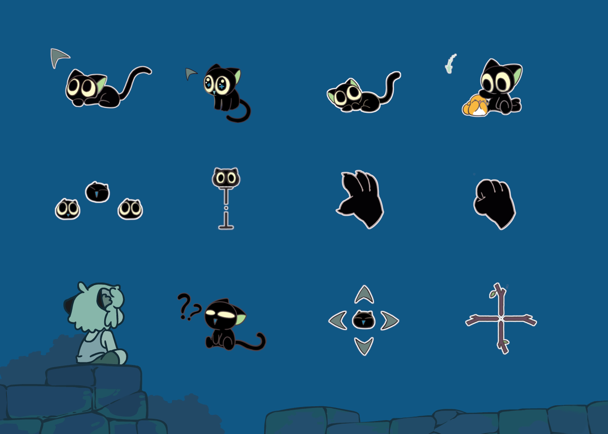

# **Hei Cursor Theme**

[中文](./README.md) | English



## About

- **Original Author**: [Bilibili @1013625945 (漓翎_cub)](https://space.bilibili.com/1013625945)
- **Ported by**: [GitHub @Tseshongfeeshur (Ryan)](https://github.com/Tseshongfeeshur)

As of the project’s release date (2025-12-06), the original author has only provided versions for Windows and macOS. Since no [GNU](https://www.gnu.org/)/[Linux](https://kernel.org/) version was available, this theme has been ported into an [XDG cursor theme package](https://specifications.freedesktop.org/icon-theme/latest/) that works with most [GNU](https://www.gnu.org/)/[Linux](https://kernel.org/) desktop environments. **Great thanks to the original author — without his work, this port would not exist, and we wouldn’t be able to enjoy such a beautiful cursor theme.**

## Project Content

- Based on the character **“Hei”** from the series [*The Legend of Hei*](https://en.wikipedia.org/wiki/The_Legend_of_Hei), designed and created by **[漓翎_cub](https://space.bilibili.com/1013625945)**
- **Mostly** animated cursors
- Supports **24 / 32 / 48 / 64 / 96 / 128 / 192 / 256 / 512** pixel resolutions

## Supported Targets

- All [GNU](https://www.gnu.org/)/[Linux](https://kernel.org/) desktop environments that support [XDG cursor themes](https://specifications.freedesktop.org/icon-theme/latest/)
  - Fully tested and works well under [KDE Plasma](https://kde.org/plasma-desktop/) and [GNOME](https://www.gnome.org/)

## Installation

### Arch Linux

#### Install with an AUR helper

```bash
paru -S hei-cursors-git
```

**Or**, using any other AUR helper you prefer:
```bash
yay -S hei-cursors-git
```

#### Install the AUR package manually

```bash
sudo pacman -S --needed base-devel
git clone https://aur.archlinux.org/hei-cursors-git.git
cd hei-cursors
makepkg -si
```

**Or**, install manually **(not recommended, as `pacman` will not track the package)**.

## Other Distributions (Manual Installation)

### Install `git`

- Debian
  ```bash
  sudo apt update
  sudo apt install git
  ```

- Fedora
  ```bash
  sudo dnf install git
  ```

- Arch Linux
  ```bash
  sudo pacman -S git
  ```

2. Install for the **current user**:
   ```bash
   git clone https://github.com/Tseshongfeeshur/hei-cursors.git hei_cursors
   mkdir -p ~/.local/share/icons/
   mv ./hei_cursors ~/.local/share/icons/
   ```
   
   **Or**, install for **all users** **(not recommended)**:
   ```bash
   git clone https://github.com/Tseshongfeeshur/hei-cursors.git hei_cursors
   sudo mkdir -p /usr/share/icons/
   sudo mv ./hei_cursors /usr/share/icons/
   ```
## Applying the Cursor Theme

### KDE Plasma

1. Open **System Settings → Appearance & Style → Colors & Themes → Cursors**, or run:
   ```bash
   systemsettings kcm_cursortheme
   ```

2. Select the "**Hei**" cursor theme and click "**Apply**"
3. Choose a cursor size that feels comfortable

### GNOME

1. Install `gnome-tweaks`
   - Debian
     ```bash
     sudo apt update
     sudo apt install gnome-tweaks
     ```

   - Fedora
     ```bash
     sudo dnf install gnome-tweaks
     ```

   - Arch Linux
     ```bash
     sudo pacman -S gnome-tweaks
     ```

2. Open **Tweaks → Appearance → Cursor**
3. Select the "**Hei_cursor**" cursor theme from the dropdown list
4. Optionally adjust the cursor size via command line:
   ```bash
   gsettings set org.gnome.desktop.interface cursor-size $px
   # Replace $px with your desired size, e.g. 48
   ```

### Other Desktop Environments / Window Managers

Due to the wide variety of desktop environments and window managers, please refer to the corresponding official documentation on how to apply XDG-compatible cursor themes.

## Acknowledgements

- **Original author** [漓翎_cub](https://space.bilibili.com/1013625945).
  Without his contribution, this project would not exist.
- `xorg-xcursorgen`, for making multi-resolution cursor generation convenient and reliable
